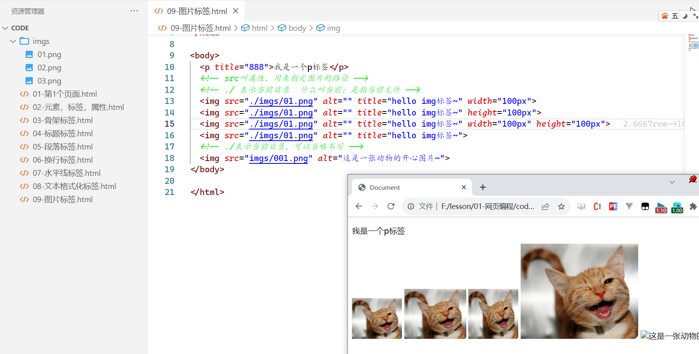
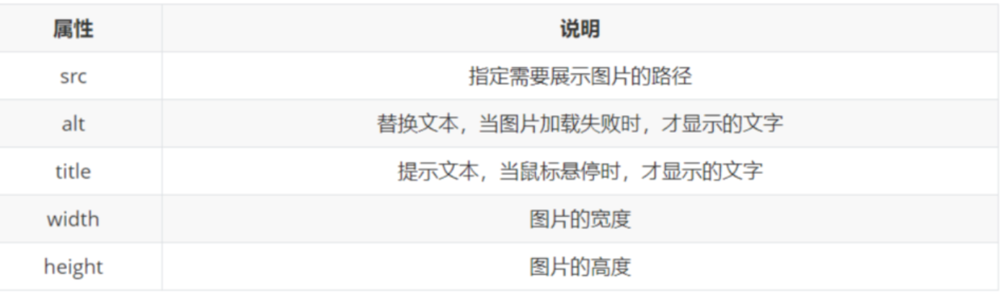

# 一，HTML常用标签


### 1， 骨架标签

**文档声明：**

- HTML最上方的一段文本我们称之为 文档类型声明，用于声明文档类型
- HTML文档声明，告诉浏览器当前页面是HTML5页面
- 让浏览器用HTML5的标准去解析识别内容
- 须放在HTML文档的最前面，不能省略，省略了会出现兼容性问题

```html
<!DOCTYPE html>
```

**HTML元素**

- html元素 表示一个 HTML 文档的根（顶级元素），所以它也被称为根元素，所有其他元素必须是此元素的后代。
- lang属性的作用：帮助语音合成工具确定要使用的发音。
- 帮助翻译工具确定要使用的翻译规则
- lang=“zh-CN”表示这个HTML文档的语言是中文
- lang=“en”表示这个HTML文档的语言是英文

**HEAD元素**

- 设置文档相关的配置信息（也称之为元数据），包括文档的标题，引用的文档样式和脚本等
- 常用设置：网页的标题，网页的编码等...

**BODY元素**

- body元素里面的内容将是你在浏览器窗口中看到的东西，也就是网页的具体内容和结构，之后学习的大部分HTML元素都是在body中编写呈现的

代码如下 ：

```html
<!DOCTYPE html>
<html lang="zh-CN">

<head>
    <title>淘宝网</title>
    <meta charset="utf-8">
</head>

<body>
    <div>我是一个div</div>
    <p>我是一个p标签</p>
</body>

</html>
```

浏览器的调试工具，按F12或鼠标右键，点击检查，如下：


### 2，标题标签

**单词**：heading是头部的意思，通常会用来做标题

**场景**: 在新闻和文章的页面中，都离不开标题，用来突出显示文章主题

**语义**: 1~6级标题，重要程度依次递减，h1级别最高，而h6级别最低

**特点**：

1. 文字都有加粗
2. 文字都有变大，并且从h1 → h6文字逐渐减小
3. 独占一行

**注意点**： 1.h1标签对于网页尤为重要，开发中有特定的使用场景，如：新闻的标题、网页的logo部分 2.h元素通常和SEO优化有关系（什么是SEO，后续再介绍）

代码：

```html
<!DOCTYPE html>
<html lang="zh-CN">

<head>
    <title>淘宝网</title>
    <meta charset="utf-8">
</head>

<body>
    <!-- 只要是一个网站，基本上都有h1标签 -->
    <!-- 即使没有大标题，也会使用h1标签把网页的logo包起来 -->
    <!-- h1标签有利于SEO -->
    <h1>我是一个大标题</h1>
    <h2>我是一个H2标签</h2>
    <h3>我是一个H3标签</h3>
</body>

</html>
```

浏览器效果：


### 3，段落标签

**单词**：p元素是paragraph单词的缩写，是段落、分段的意思

**场景**: 在新闻和文章的页面中，用于分段显示

**语义**: 段落

**特点**：

1. 段落之间存在间隙
2. 独占一行
3. 满一行会自动换行

**注意点**： 1.p元素多个段落之间会有一定的间距 2. 可以配合br标签进行换行

代码：

```html
<!DOCTYPE html>
<html lang="zh-CN">

<head>
    <title>淘宝网</title>
    <meta charset="utf-8">
</head>

<body>
    <h1>胡歌深夜发声：如果未来五年，不拍戏，去做一些更有意义的事……网友炸了！</h1>
    <p>2023-08-22 09:42 山东 鲁中晨报社官方账号,优质社会领域创作者</p>
    <hr>
    <p>8月21日深夜，著名男演员胡歌突然发了这篇欲语还休的微博，并附上两张以沙漠为背景的自拍照。很快，“胡歌五年不拍戏”登上热搜榜第一，引发网友对其“又要退圈”的猜测，“这是要去沙漠种树？”</p>

    <p>为什么要说“又”呢？因为多年前，正当红的胡歌就斩钉截铁地说要去留学充实自己，对名利场表现得毫无留恋。而从胡歌这一次发文内容来看，他是准备把自己的时间都花在公益事业上，甚至不惜搁置表演事业。</p>

    <p>极目新闻记者在胡歌的社交平台留言区看到，不少粉丝并不支持胡歌这种“退圈”行为。一位激动的粉丝连发数条留言，希望胡歌能三思而后行，“你去数数你这几年拍了几部戏？产量低到极致了还想减？不支持不支持不支持！”</p>
</body>

</html>
```

浏览器效果：


### 4，换行标签

**场景**: 让文字强制换行显示

**语义**: 换行

**特点**：

1. 单标签
2. 让文字强制换行

代码：

```html
<!DOCTYPE html>
<html lang="zh-CN">

<head>
    <title>淘宝网</title>
    <meta charset="utf-8">
</head>

<body>
    <h1>胡歌深夜发声：如果未来五年，不拍戏，去做一些更有意义的事……网友炸了！</h1>
    <p>2023-08-22 09:42 山东 鲁中晨报社官方账号,优质社会领域创作者</p>
    <hr>
    <!--  单标签，/ 可以写  也可以不写  <br>  <br/> -->
    <p>8月21日深夜，<br>著名男演员胡歌突然发了这篇欲语还休的微博，<br />并附上两张以沙漠为背景的自拍照。<br />很快，“胡歌五年不拍戏”登上热搜榜第一，<br />引发网友对其“又要退圈”的猜测，“这是要去沙漠种树？”
    </p>
</body>

</html>
```

浏览器效果：


### 5，水平线标签

**场景**: 分割不同主题内容的水平线

**语义**: 主题的分割转换

**特点**：

1. 单标签
2. 在页面中显示一条水平线

代码：

```html
<!DOCTYPE html>
<html lang="zh-CN">

<head>
    <title>淘宝网</title>
    <meta charset="utf-8">
</head>

<body>
    <!-- 单标签，独占一行 -->
    <hr>
    <!-- color表示设置水平线的颜色 -->
    <hr color="red">
    <!-- size表示设置水平线的高度 -->
    <hr size="20px" color="gold">
    <!-- shift+alt+向下箭头  复制上一行代码 -->
    <!-- width表示设置水平线的宽度 -->
    <hr size="20px" color="gold" width="30%">
    <!-- 默认情况下，水平线在浏览器最中间，可以设置它的对齐方式 -->
    <!-- align用来设置对齐方式  left 左对齐  right 右对齐   center居中对齐（默认） -->
    <hr size="20px" color="skyblue" width="30%" align="left">
</body>

</html>
```


### 6，文本格式化标签

**场景**: 需要让文字加粗、下划线、倾斜、删除线等效果

**语义**: 突出重要性的强调语境

**特点**：strong、ins、em、del，表示的强调语义更强烈！


代码：

```html
<!DOCTYPE html>
<html lang="zh-CN">

<head>
    <title>淘宝网</title>
    <meta charset="utf-8">
</head>

<body>
    <b>今天开始学习HTML了，明天学习CSS</b> <br>
    <u>今天开始学习HTML了，明天学习CSS</u> <br>
    <i>今天开始学习HTML了，明天学习CSS</i> <br>
    <s>今天开始学习HTML了，明天学习CSS</s> <br>
    <hr>
    <!-- b标签仅仅是加粗，strong标签不只可以加粗，还可以强调，有利于SEO -->
    <strong>今天开始学习HTML了，明天学习CSS</strong> <br>
    <!-- em标签也有强调的意思，表示形式和 i 标签是一样，会倾斜-->
    <!-- 使用strong和em能达到的效果，使用css也可以达到，但是strong和em有强调作用 -->
    <em>今天开始学习HTML了，明天学习CSS</em> <br>

    <!-- ins和del标签，不重要，了解就OK -->
    <!-- ins和del标签达到的效果，使用CSS也可以使用 -->
    <ins>今天开始学习HTML了，明天学习CSS</ins> <br>
    <del>今天开始学习HTML了，明天学习CSS</del> <br>
</body>

</html>
```

浏览器效果如下：


### 7，图片标签

**标签的分类**：后面每学一个标签，先搞清楚它的性别。

- 块级标签 独占一行 男标签
- 行内标签 并排显示 女标签
- 行内块标签 并排显示 人妖标签 就需要掌握两个：img和input

**单词**：img是image单词的所以，是图像、图像的意思

**场景**: 在网页中显示图片，叫前景图。


**特点**：

1. 单标签 2.img标签需要展示对应的效果，需要借助标签的属性进行设置 3.img并排显示（人妖标签）

**src属性**： 1.source单词的缩写，表示源，目标图片的路径 2. 是必须的，它包含了你想嵌入的图片的文件路径 3. 路径的情况有很多，稍后会详细介绍

下载图片，通常会把图片放在imgs文件夹中，如下：


直接上代码：


浏览器中效果如下：


图片标签，还有一些其它的属性，如下：

**alt属性**：

1. 不是强制性的，用来替换文本
2. 当图片加载失败时，才显示alt的文本
3. 当图片加载成功时，不会显示alt的文本
4. 屏幕阅读器会将这些描述读给需要使用阅读器的使用者听，让他们知道图像的含义；

代码：


**title属性**：

1. 提示文本，当鼠标悬停时，才显示的文本 2.title属性不仅仅可以用于图片标签，还可以用于其他标签

代码：


**width和height属性**：

1. 如果只设置width或height中的一个，另一个没设置的会自动等比例缩放（此时图片不会变形）
2. 如果同时设置了width和height两个，若设置不当此时图片可能会变形



总结img标签身上的属性，如下：



图片的路径（重点）

- 绝对路径（少一点）
  - 指目录下的绝对位置，可直接到达目标位置，通常从盘符开始的路径， 如：F:\lesson\01-网页编程\code\imgs\01.png
  - 完整的网络地址：https://www.baidu.com/images/logo.gif
- 相对路径（常用）
  - 从当前文件开始出发找目标文件的过程
  - ./ 当前文件夹，可以省略
  - ../ 代表上级文件夹，不能省略

代码：


渲染../的使用，如下：


看一下不案例：

```html
<!DOCTYPE html>
<html lang="en">

<head>
    <meta charset="UTF-8">
    <title>Document</title>
</head>

<body>
    <h1>圣诞节的那些事</h1>
    <!-- 写的文本，可以不使用标签去包裹，但是建议，只要是文本最好使用标签去包裹一下 -->
    1.圣诞是怎样由来的 <br>
    2.圣诞老人的由来 <br>
    3.圣诞树的由来 <br>

    <h2>圣诞是怎样由来的</h2>
    <p>圣诞节是基督教世界最大的节日。一般认为12月25日作为圣诞节可能开始于公元336年的罗马教会。4世纪初，1月6日是罗马帝国东部各教会纪念耶稣降生和受洗的双重节日，即上帝通过耶稣向世人显示自己。 这一天又是罗马历书的冬至节，意味着万物复苏的开始。可能由于这个原因，罗马教会才选择这一天作为圣诞节。后来，因为各地教会使用的历书不同，具体日期不能统一，于是就把12月24日到第二年的1月6日定为圣诞节节期（Christmas Tide），各地教会可以根据当地具体情况在这段节期之内庆祝圣诞节。 在欧美许多国家里，人们非常重视这个节日，把它和新年连在一起，而庆祝活动之热闹与隆重大大超过了新年，成为一个全民的节日。12月24日平安夜、12月25日圣诞节的主要纪念活动都与耶稣降生的传说有关 。</p>

    

    <h2>圣诞老人的由来</h2>
    <p>
        圣诞节当然少不了<a href="">圣诞老人</a>，根据圣经记载，书中并没有提起这一号人物。到底他是如何成为圣诞的主角之一呢？
    </p>
    

    <p>相传在一千六百多年前，荷兰巴里地方有一个老人，名叫尼古拉斯，他一生最爱帮助贫穷的人家。其中有一次他帮助三个贫穷的少女，送她们三袋金子以逃过被卖的不幸。</p>
    <p>到了一八二二年，由荷兰传教士把这位伟大慈善家的故事传到美国，装扮圣诞老人渐渐地流行于世界各国。根据调查，以上故事还有下文；当尼古拉斯偷偷把其中一袋金子送给其中一名女子时，他把金子从其中一个窗户扔进去，恰好掉进晾在壁炉上的一只长袜中。于是，将礼物放在圣诞袜子的送礼方法便传到至今。</p>
    <p>在平安夜里，孩子总会把一双双色彩缤纷的袜子挂在床头，然后在袜子旁边放杯热牛奶让圣诞老人喝，以让劳苦功高的圣诞老人解渴，并送份大礼给自己。?</p>

    <h2>圣诞树的由来</h2>
    <p>圣诞一直是庆祝圣诞节不可少的装饰物，如果家中没有圣诞树，就大大减少了过节气氛。关于圣诞树的来源有多种不同的传说。</p>
    <p>其中一个是说：大约在十六世纪，圣诞树最先出现在德国，德国人把长青的松柏枝拿到屋中去摆设，将之成为圣诞树。后来，由德国人马丁路德把蜡烛放在树林中的枞树枝，然后点燃蜡烛，使它看起来像是引导人们到伯利恒去。而近今日，人们已经改用粉色的小灯泡了。
    </p>
    <p>另一个传说记载。在很久以前，曾有一位农民，在圣诞节那天遇到一个穷苦小孩，他热情地接待了这个儿童。儿童临走时折下一根松枝插在地上，松枝立即变成一棵树，上面都挂满礼物，以答谢农民的好意。</p>
    <p>圣诞树真正出现在圣诞节时，首先见于德国，之后又传入欧洲和美国，并以其优美的姿态，成为圣诞节不可缺少的装饰。圣诞树的种类繁多，有天然松柏圣诞树、也有人造圣诞树及白色圣诞树。 每棵圣诞树上都挂满琳琅满目的装饰品，但每棵树的顶端必定有个特大的星星，象征三博士跟随该星而找到耶稣，而且也只有该家庭的一家之主可以把这棵希望之星挂上。</p>

    

    <p>更多内容可以 <a href="http://www.baidu.com">百度一下</a></p>
</body>

</html>
```

浏览器效果如下：


### 8，超链接标签


**单词**：anchor，a标签，或叫锚（anchor）元素、超链接、锚链接

**场景**: 点击之后，从一个页面跳转到另一个页面

**语义**: 超链接

**特点**：

1. 双标签，内部可以包裹内容
2. 如果需要a标签点击之后去指定页面，需要设置a标签的href属性 3.a标签默认文字有下划线 4.a标签从未点击过，默认文字显示蓝色 5.a标签点击过之后，文字显示为紫色（清除浏览器历史记录可恢复蓝色）

**href属性**：

1. Hypertext Reference的简称
2. 点击之后跳转去哪一个网页（目标网页的路径）
3. 指定要打开的URL地址，外部链接
4. 也可以是一个本地地址，内部链接

代码：

```html
<!DOCTYPE html>
<html lang="en">

<head>
    <meta charset="UTF-8">
    <title>Document</title>
</head>

<body>
    <!-- 一个正确的网址，是以http或https打头，在浏览器中输入时会自动补全 -->
    <!-- https://www.baidu.com/ -->
    <!-- 特点：
          1）鼠标去摸时，会变成手形
          2）女标签  特点：并排显示   人妖标签就两个：img  input
          3）默认有下划线
          4）a标签默认有颜色  
  -->
    <!-- 分类：
         1）外部链接   链接到别人的网页
         2）内部链接   连接自己的网页
  -->
    <a href="http://www.baidu.com">百度一下</a>
    <a href="http://www.baidu.com">百度一下</a>
    <hr>
    <a href="./01-第1个页面.html">第1个页面</a>
</body>

</html>
```

浏览器效果如下：


**target属性**：

1. 该属性指定在何处显示链接的资源 1._self：默认值，在当前窗口（选项卡）打开URL； 2._blank：在一个新的窗口（选项卡）中打开URL
2. 其他不常用

浏览器选项卡：


代码：


还可以实现空链接，点击之后回到网页顶部。相当于是回到顶部。代码：


关于超链接还有一些知识点，后期再去补充。

### 9，DIV和SPAN

**单词**：div元素：division，分开、分配的意思。span元素：跨域、涵盖的意思。

**场景**: 实际开发网页时会大量频繁的使用到div和span这两个没语义的布局标签。主要是配合CSS完成布局。

**特点**： 1.div标签：一行只显示一个（独占一行） 男标签 2.span标签：一行可以显示多个 女标签

**两者区别**： 1.div元素和span元素都是“纯粹的” 容器，也可以把他们理解成“盒子”，它们都是用来包裹内容的 2.div元素：多个div元素包裹的内容会在不同的行显示，用于把网页分割为多个独立的部分 3. 一般作为其他元素的父容器，把其他元素包住，代表一个整体 4. 多个span元素包裹的内容会在同一行显示, 默认情况下，跟普通文本几乎没差别 5. 用于区分特殊文本和普通文本，比如用来显示一些关键字

代码：

```html
<!DOCTYPE html>
<html lang="en">

<head>
    <meta charset="UTF-8">
    <title>Document</title>
</head>

<body>
    <!-- div是男标签，独占一行的 -->
    <!-- 一个网页是N块组成的，每一块都可以放在div中 -->
    <div class="box1">我是一个孤独的DIV</div>
    <div class="box2">我是一个孤独的DIV</div>
    <div class="box3">我是一个孤独的DIV</div>

    <!-- span标签是女标签，并排显示 -->
    <span>我是一个小小的span</span>
    <span>我是一个小小的span</span>
    <span>我是一个小小的span</span>
    <hr>
    <!-- 一个文本，加不加span，在网页上显示的效果是一样的 -->
    <!-- 不会直接暴露文本，会使用标签包起来，目的是配合css完成页面的布局和美化 -->
    我是一个小小的span
    我是一个小小的span
    我是一个小小的span
</body>

</html>
```

浏览器效果：


### 10，列表类标签


在开发一个网页的过程中, 很多数据都是以列表的形式存在的。

**场景**: 在网页中按照行展示关联性的内容，如：新闻列表、排行榜、账单等

**种类**: 无序列表、有序列表、自定义列表

**注意点：**

- 基本上所有的网页，都有所谓的列表标签
- 列表标签不是一标签，是一组标签
- 有序列表是指列表项与列表项之间有顺序
- 无序列表是指列表项与列表项之间没有顺序
- 自定义列表，自定义列表主要是对某个名字，事件，时间进行解释说明的

**无序列表**（unordered list）

1. 场景：在网页中表示一组无顺序之分的列表，如：新闻列表 2.ul标签：表示无序列表的整体，ul标签中只允许包含li标签 3.li标签：表示无序列表的每一项，li标签可以包含任意内容 4.li标签可以包含任意内容
2. 列表的每一项前默认显示圆点标识

代码：

```html
<!DOCTYPE html>
<html lang="en">

<head>
    <meta charset="UTF-8">
    <title>Document</title>
</head>

<body>
    <!-- unorder list
         1）不是一个标签，是一组标签  ul + li  
         2）order是订单，有序的意思   unordered是无序的意思  list列表的意思 
         3）ul是无序列表  li是无序列表中的列表项  
         4）ul中只能放li元素 
  -->
    <h1>常见的编程语言</h1>
    <!-- ul 中有一个type属性，用来指定列表项前面的标识样式 -->
    <!-- type="square" 属性值有很多，不需要记，因为，后面学习CSS，主要通过CSS来设置 -->
    <ul type="square">
        <li>JavaScript</li>
        <li>Java</li>
        <li>C</li>
        <li>C#</li>
        <li>C++</li>
        <li>Python</li>
        <li>汇编</li>
        <li>易语言</li>
        <li>Go</li>
        <li>PHP</li>
    </ul>
</body>

</html>
```

浏览器效果如下：


**有序列表（ordered list）**：

1. 场景：在网页中表示一组有顺序之分的列表，如：排行榜。 2.ol标签中只允许包含li标签 3.li标签可以包含任意内容
2. 列表的每一项前默认显示序号标识

代码：

```html
<!DOCTYPE html>
<html lang="en">

<head>
    <meta charset="UTF-8">
    <title>Document</title>
</head>

<body>
    <!-- 
    有序列表：
        1）是一组标签   ol+li 
        2）ol 是有序列列表的意思 ordered list
        3）li 是list item的意思  列表项
        4）列表项与列表项之间是有顺序的
        5）ol只能放li   li里面可以放任何内容
  -->
    <h1>飙升榜</h1>
    <ol>
        <li><a href="#">看得最远的地方</a></li>
        <li><a href="#">圆</a></li>
        <li><a href="#">下一站天后</a></li>
        <li><a href="#">孤独患者</a></li>
    </ol>
</body>

</html>
```

浏览器效果：


**自定义列表（definition list）**：

1. 场景：在网页的底部导航中通常会使用自定义列表实现。 2.dl标签中只允许包含dt（definition term）/dd（definition description）标签 3.dt/dd标签可以包含任意内容 4.dd前会默认显示缩进效果
2. 列表中每一项的具体描述，是对 dt 的描述、解释、补充
3. 一个dt后面一般紧跟着1个或者多个dd

代码：

```html
<!DOCTYPE html>
<html lang="en">

<head>
    <meta charset="UTF-8">
    <title>Document</title>
</head>

<body>
    <!-- 
    自定义列表：
        1）definition 自定义的意思  list 是列表的意思    dl
        2）对一个事件，时间点，名词等解释说明
        3）是一组标签  dl + dt + dd  
        4）dt   definition term/title   
        5）dd   definition description   description是描述的意思
        6）dt和dd中可以包含任何内容
   -->
    <h1>前端开发</h1>
    <dl>
        <dt>阶段一：打好基本阶段</dt>
        <dd>HTML</dd>
        <dd>CSS</dd>
        <dd>JS基础</dd>
        <dd>DOM操作</dd>
        <dd>JS高级</dd>
        <dt>阶段二：框架实战</dt>
        <dd>vue</dd>
        <dd>react</dd>
        <dd>ng</dd>
        <dd>node</dd>
        <dt>阶段三：原理讲解</dt>
        <dd>js原理</dd>
        <dd>vue原理</dd>
        <dd>react原理</dd>
    </dl>
</body>

</html>
```

浏览器效果：


**总结**

1. 无序列表最常用，有序列表偶尔用，自定义列表底部导航用

### 11，表格类标签


在后台管理系统之类的项目，表格和表单，用的非常多。

**单词**： 1.table 表格 也有桌子的意思 2.tr(table row) 表格中的行 row是行的意思 一个tr就是一行 3.td(table data) 行中的单元格 单元格 4.thead 表格的表头 可以不写的 5.tbody 表格的主体 可以不写的 6.tfoot 表格的页脚 可以不写的 7.caption 表格的标题 8.th 表格的表头单元格


代码：

```html
<!DOCTYPE html>
<html lang="en">

<head>
    <meta charset="UTF-8">
    <title>Document</title>
    <style>
        table {
            /* collapse 合并边框 */
            border-collapse: collapse;
        }
    </style>
</head>

<body>
    <table border="1" width="500px" height="200px" align="center">
        <tr align="center">
            <th>排名</th>
            <th>股票名称</th>
            <th>股票代码</th>
            <th>股票价格</th>
            <th>股票涨跌</th>
        </tr>
        <tr align="center">
            <td>1</td>
            <td>贵州茅台</td>
            <td>600519</td>
            <td>1800</td>
            <td>5%</td>
        </tr>
        <tr align="center">
            <td>2</td>
            <td>腾讯控股</td>
            <td>00700</td>
            <td>400</td>
            <td>3%</td>
        </tr>
        <tr align="center">
            <td>3</td>
            <td>五粮液</td>
            <td>00858</td>
            <td>160</td>
            <td>8%</td>
        </tr>
        <tr align="center">
            <td>4</td>
            <td>东方财富</td>
            <td>30059</td>
            <td>25</td>
            <td>4%</td>
        </tr>
    </table>
</body>

</html>
```

浏览器效果：


表格中还有thead，tbody，tfoot，caption，使用之，如下：

```html
<!DOCTYPE html>
<html lang="en">

<head>
    <meta charset="UTF-8">
    <title>Document</title>
    <style>
        table {
            /* collapse 合并边框 */
            border-collapse: collapse;
        }
    </style>
</head>

<body>
    <table border="1" width="500px" height="200px" align="center">
        <caption>热门股票</caption>
        <thead>
            <tr align="center">
                <th>排名</th>
                <th>股票名称</th>
                <th>股票代码</th>
                <th>股票价格</th>
                <th>股票涨跌</th>
            </tr>
        </thead>
        <tbody>
            <tr align="center">
                <td>1</td>
                <td>贵州茅台</td>
                <td>600519</td>
                <td>1800</td>
                <td>5%</td>
            </tr>
            <tr align="center">
                <td>2</td>
                <td>腾讯控股</td>
                <td>00700</td>
                <td>400</td>
                <td>3%</td>
            </tr>
            <tr align="center">
                <td>3</td>
                <td>五粮液</td>
                <td>00858</td>
                <td>160</td>
                <td>8%</td>
            </tr>
            <tr align="center">
                <td>4</td>
                <td>东方财富</td>
                <td>30059</td>
                <td>25</td>
                <td>4%</td>
            </tr>
        </tbody>
        <tfoot align="center">
            <td>xxx</td>
            <td>xxx</td>
            <td>xxx</td>
            <td>xxx</td>
            <td>xxx</td>
        </tfoot>
    </table>
</body>

</html>
```

浏览器中效果：


单元格是可以合并的，将水平或垂直多个单元格合并成一个单元格，如下：


直接上代码：

```html
<!DOCTYPE html>
<html lang="en">

<head>
    <meta charset="UTF-8">
    <title>Document</title>
    <style>
        table {
            border-collapse: collapse;
        }
    </style>
</head>

<body>
    <table border="1" width="200px">
        <tr>
            <td rowspan="2">1-1</td>
            <td>1-2</td>
        </tr>
        <tr>
            <!-- <td>2-1</td> -->
            <td>2-2</td>
        </tr>
    </table>
    <hr>
    <table border="1" width="200px">
        <tr>
            <td colspan="2">1-1</td>
            <!-- <td>1-2</td> -->
        </tr>
        <tr>
            <td>2-1</td>
            <td>2-2</td>
        </tr>
    </table>
</body>

</html>
```

浏览器效果：


写一个值日表案例：

```html
<!DOCTYPE html>
<html lang="en">

<head>
    <meta charset="UTF-8">
    <title>Document</title>
    <style>
        table {
            border-collapse: collapse;
        }
    </style>
</head>

<body>
    <table border="1" width="460px" align="center">
        <caption>值日表</caption>
        <thead>
            <tr>
                <th>星期一</th>
                <th>星期二</th>
                <th>星期三</th>
                <th>星期四</th>
                <th>星期五</th>
                <th>星期六</th>
            </tr>
        </thead>
        <tbody>
            <tr>
                <td>1-1</td>
                <td>1-2</td>
                <td>1-3</td>
                <td>1-4</td>
                <td>1-5</td>
                <td>1-6</td>
            </tr>
            <tr>
                <td>2-1</td>
                <td>2-2</td>
                <td>2-3</td>
                <td>2-4</td>
                <td>2-5</td>
                <td>2-6</td>
            </tr>
            <tr>
                <td>3-1</td>
                <td>3-2</td>
                <td rowspan="2" colspan="2">3-3</td>
                <!-- <td>3-4</td> -->
                <td>3-5</td>
                <td>3-6</td>
            </tr>
            <tr>
                <td>4-1</td>
                <td>4-2</td>
                <!-- <td>4-3</td> -->
                <!-- <td>4-4</td> -->
                <td>4-5</td>
                <td>4-6</td>
            </tr>
            <tr>
                <td colspan="2" rowspan="3">5-1</td>
                <!-- <td>5-2</td> -->
                <td>5-3</td>
                <td>5-4</td>
                <td>5-5</td>
                <td>5-6</td>
            </tr>
            <tr>
                <!-- <td>6-1</td>
        <td>6-2</td> -->
                <td>6-3</td>
                <td>6-4</td>
                <td>6-5</td>
                <td>6-6</td>
            </tr>
            <tr>
                <!-- <td>7-1</td>
        <td>7-2</td> -->
                <td>7-3</td>
                <td colspan="3">7-4</td>
                <!-- <td>7-5</td>
        <td>7-6</td> -->
            </tr>
        </tbody>
    </table>
</body>

</html>
```

浏览器中效果：


### 13，表单类标签